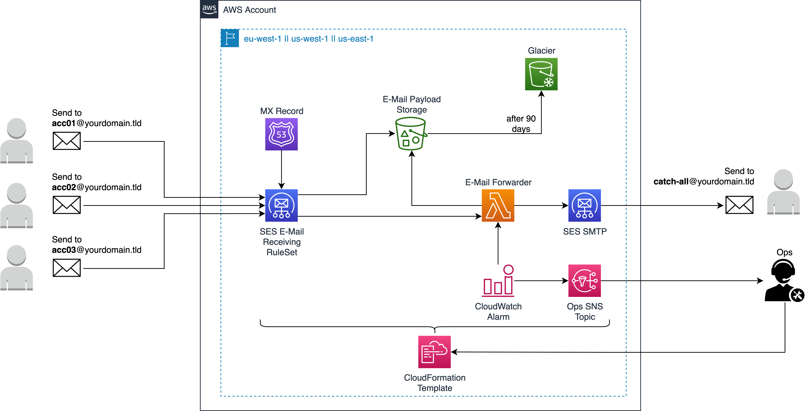

# AWS SES E-Mail Receive and Forwarding
CloudFormation template which automates the E-Mail receiving and forwarding logic initially introduced in the AWS Blog post [Forward Incoming Email to an External Destination](https://aws.amazon.com/blogs/messaging-and-targeting/forward-incoming-email-to-an-external-destination/)

# Prerequisite
* Existing Route53 Public Hosted Zone

# Usage
* Download and deploy the CloudFormation [template](./E-Mail_Receive_Forwarding_CFT.yml) in your account 